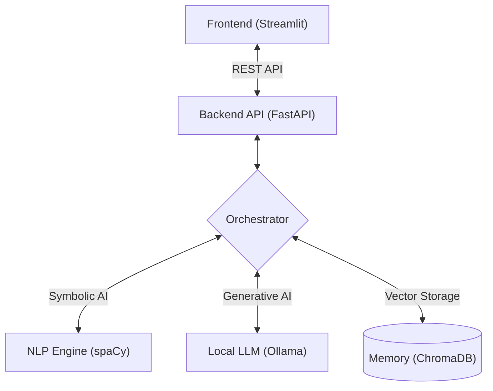

# 🧠 Smart Text Analyzer (Local AI + RAG)

> **A Privacy-First, Hybrid AI Analysis Platform** > *Developed by Degenbayev Nurkanat* > *Subject: Artificial Intelligence Neural Networks and Generative AI*

---

## 📌 Project Overview
**Smart Text Analyzer** is an enterprise-grade NLP (Natural Language Processing) tool designed to process, understand, and "remember" unstructured text data. 

Unlike standard cloud-based tools, this project runs **100% locally** using **Ollama (Mistral/Llama3)**, ensuring absolute data privacy. It implements a **Hybrid Intelligence Architecture**, combining classical NLP (spaCy) for precision with Generative AI (LLM) for reasoning.

Uniquely, it features a **RAG (Retrieval-Augmented Generation) Memory System**, allowing users to chat with their historical data and retrieve insights from past documents.

---

## 🚀 Key Features

### 1. 🧠 Hybrid Analysis Engine
- **Named Entity Recognition (NER):** Detects Organizations, People, and Locations using `spaCy`.
- **Sentiment & Intent:** Uses Local LLM to determine mood (Positive/Negative) and purpose (Complaint/Inquiry).
- **Topic Extraction:** Automatically categorizes text into relevant themes.

### 2. 🛡️ Absolute Privacy (Local LLM)
- No API keys required. No data leaves the user's machine.
- Powered by **Ollama**, supporting models like `Mistral`, `Llama3`, or `Gemma`.

### 3. 🗄️ Semantic Memory (RAG)
- **Vector Database (ChromaDB):** Converts every analysis into mathematical vectors.
- **Contextual Search:** Allows users to search by *meaning* (e.g., searching for "bad power" finds "battery issues").
- **Chat with Data:** Users can ask questions like *"What were the main complaints last week?"* and the AI synthesizes an answer from past records.

### 4. 📊 Premium Visualization & Reporting
- **Glassmorphism UI:** Built with Streamlit for a modern, responsive experience.
- **PDF Reports:** Generates professional, downloadable PDF summaries of any analysis.

---

Instruction:
⚙️ Installation & Setup
Prerequisites:
Python 3.12+
Ollama installed and running.

1. Clone & Environment(bash):
pip install -r requirements.txt
python -m spacy download en_core_web_sm

2. Install Dependencies(bash)
pip install -r requirements.txt
python -m spacy download en_core_web_sm

3. Setup Local AI
Pull the model (e.g., Mistral) via Ollama(bash):
ollama pull mistral

▶️ Usage
Run the Backend(Bash):
uvicorn backend.api.main:app --reload

Run the frontend(bash, new terminal):
streamlit run frontend/app.py

🤖 Acknowledgments
This project was developed with the assistance of Google Gemini, acting as a virtual pair-programmer and architectural consultant. It demonstrates the potential of AI-Assisted Software Engineering in accelerating development cycles and implementing complex patterns like RAG.

## 🏗️ System Architecture

The system follows a Microservices-based modular architecture:

Orchestrator: The central brain that manages data flow.

NLP Engine: Extracts raw facts (Entities).

LLM Provider: Synthesizes facts into insights (Summary, Sentiment).

Memory Store: Saves vectors for future retrieval.

